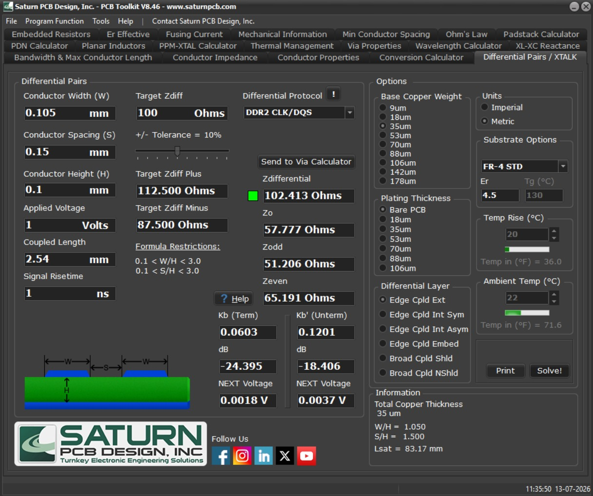
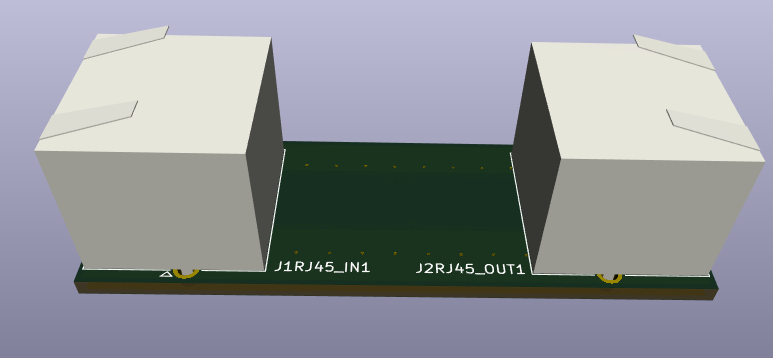

# LinkBridge

### 10 Gbps Ethernet RJ45 Coupler Board

LinkBridge is a compact high-speed Ethernet coupler board designed to connect two shielded RJ45 connectors while preserving signal integrity for 10 Gbps communication. The board was designed in KiCad with controlled impedance routing, making it suitable for high-speed differential signals.

The primary goal of this project was to practice high-speed PCB layout techniques such as differential pair routing, impedance control, and connector placement while producing a manufacturing-ready design.

---

## Features

- Supports 10 Gbps Ethernet
- Dual Shielded RJ45 Connectors
- 102.4 Ω Differential Pair Routing
- Controlled Impedance PCB Layout
- Compact Board Design
- Manufacturing Ready
- Designed in KiCad

---
---

## Differential Pair Calculations

To achieve reliable **10 Gbps Ethernet communication**, the differential pair dimensions were calculated using **Saturn PCB Toolkit**.

The final routing parameters used were:

- Differential Impedance: **102.4 Ω**
- Trace Width: **0.105 mm**
- Trace Spacing: **0.150 mm**
- Copper Thickness: **35 μm**
- FR-4 Standard Stackup

These values were selected to closely match the target impedance required for high-speed Ethernet differential signaling.

---

## PCB Preview

---

## Design Highlights

This board focuses on maintaining signal quality between two RJ45 connectors.

Some of the PCB design considerations include:

- 102.4 Ω differential impedance routing
- Length-matched differential pairs
- Symmetric connector placement
- Continuous ground reference
- Short and direct signal paths
- Manufacturing-friendly PCB layout

---

## Specifications

- Interface: RJ45
- Ethernet Speed: Up to 10 Gbps
- Differential Impedance: 102.4 Ω
- PCB Tool: KiCad
- PCB Type: High-Speed Interconnect Board

---

## Files Included

- KiCad Project
- PCB Layout
- Schematic
- Gerber Files
- Drill Files
- Technical Report

---

## Tools Used

- KiCad
- Git
- GitHub

---

## Project Status

- Schematic Completed
- PCB Layout Completed
- High-Speed Routing Completed
- Gerber Files Generated
- Technical Report Included
- Ready for Fabrication

---

This project was created as part of my PCB design practice to better understand high-speed Ethernet routing, impedance-controlled PCB design, and preparing hardware for manufacturing.
